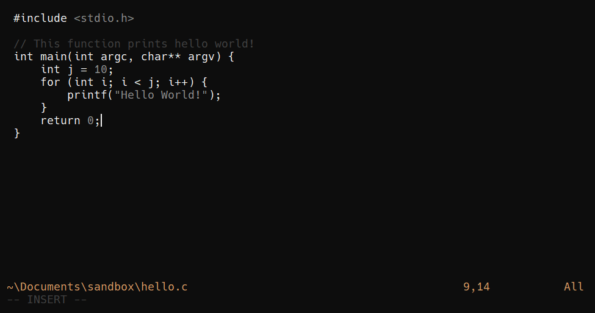

# Candle Grey



- A dark monochrome colorscheme for vim with a simple accent color
- Give an aesthetic look to vim while eliminating distracting colors

### Installation

- Using vim plug:

```vim
Plug 'aditya-azad/candle-grey'
```

and run `:PlugInstall`

- Manual install:

Just copy the `colors` folder to your vim colors folder (usually `~/.vim/colors/`).

- Once you have the scheme just add this to your `vimrc`
  - Use transparent version if you have transparency enabled in your setup

```vim
set t_Co=256 " enable colors in terminal
colorscheme candle-grey
" Or
colorscheme candle-grey-transparent
```
